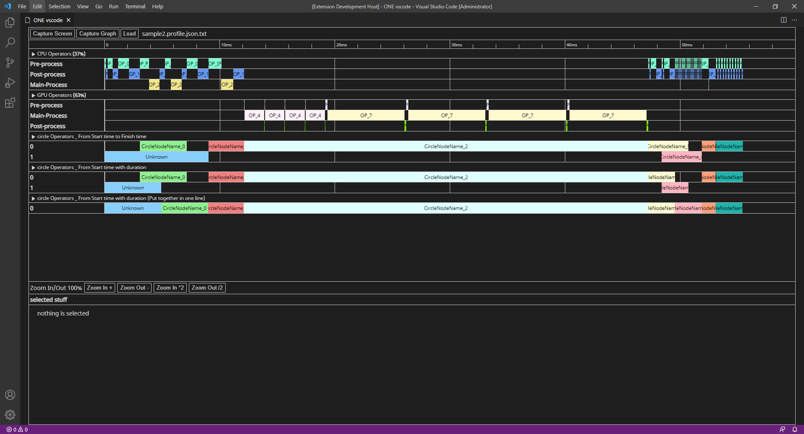
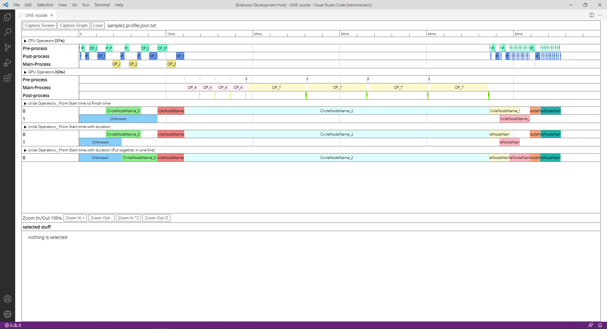
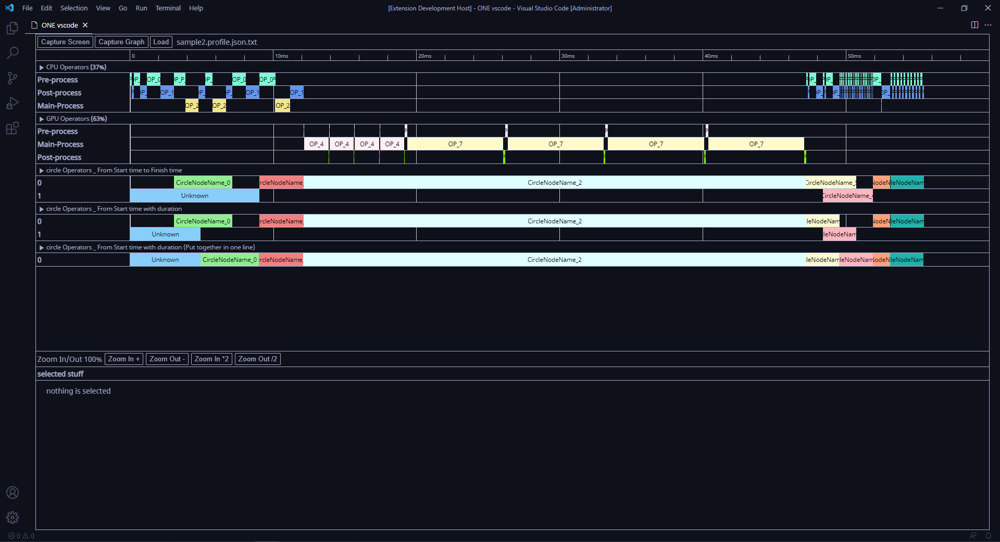
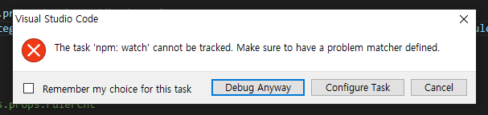

# ONE vscode extension

publisher : SSAFY TheONE

update: 21.09.13


## Preview


## Done

- Click `Load`, a file selection dialog will pop up
- You can `visualize` JSON files.
- `Zoom-in/Zoom-out` is possible.
- `pid`(GPU/CPU) usage is displayed.
- You can click on the bar to see `More info`.
- You can `open/close`  the panel.
- Fixed left bar
- Make the color a bit prettier

- When zoomed in/out, the scale is dynamically created/deleted.

- It's linked to the me in vcode.

| dark+                           | light+                            | All vcode theme support.      |
| ------------------------------- | --------------------------------- | ----------------------------- |
|  |  |  |


## Todo

- Bar `multi-selection` (individual multi-selection, section dragging). ⏫
- Zoom in with the `slider`. 🔼
- When you click `origin`, appear the node graph as a new web view. 🔼
- Capture complete message pop-up. 🔽
- Capture (Rejected from vcode webview due to security issues). 💥


## Run locally

Type `yarn` to create `node_modules`. Because the build file is also uploaded for convenience of use, `yarn watch-build` is not necessary. If the build file is deleted or there is a problem, run the command.

After that, you can run the `vscode extension` by pressing the `F5` key. Press `ctrl + shift + P` in the newly opened VScode and enter the command below to auto complete.

The following warning message may be output. Just press `Debug anyway` and proceed.




### Install

If there is no nodejs or yarn, you should install `nodejs` and `$npm install yarn`


### Run

```
$ yarn
$ yarn watch-build
```


### Command

```
ONE:one-vscode-barchart
```


### Library

| name              | git                                                    | license |
| ----------------- | ------------------------------------------------------ | ------- |
| html2canvas       | https://github.com/niklasvh/html2canvas                | MIT     |
| react             | https://github.com/facebook/react                      | MIT     |
| styled-components | https://github.com/styled-components/styled-components | MIT     |
| terser            | https://github.com/terser/terser                       | BSD     |
|                   |                                                        |         |

